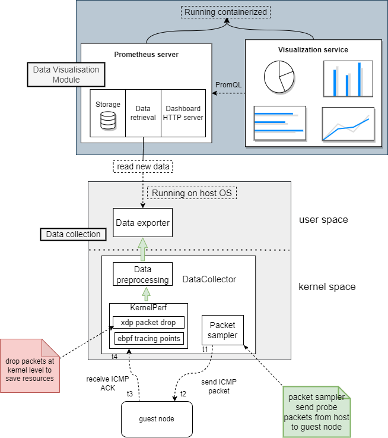
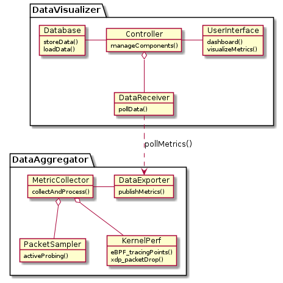
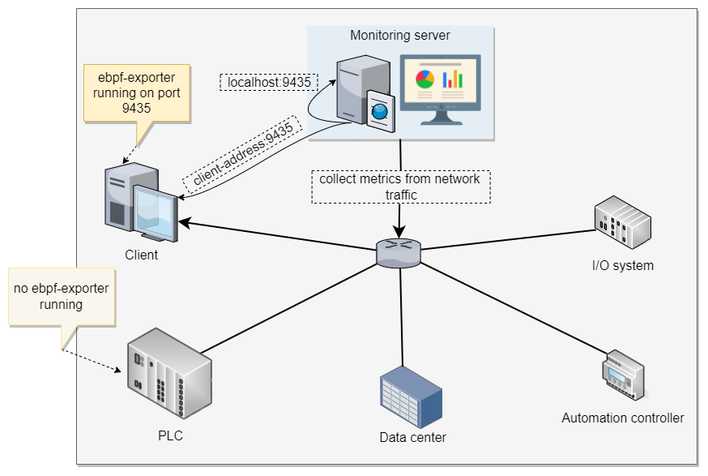
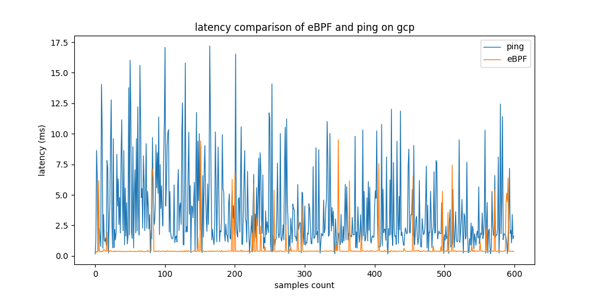
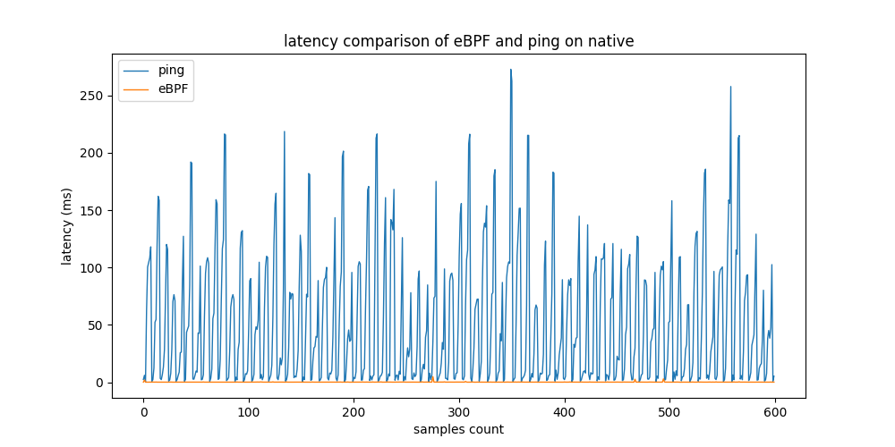
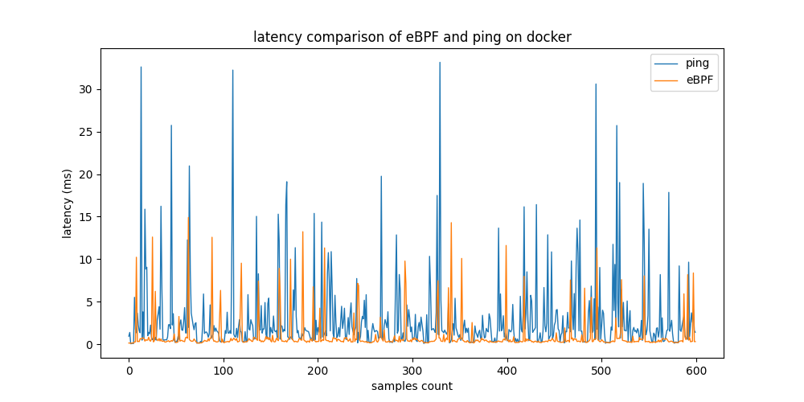

# RT network monitoring system based on eBPF

This is a real-time network monitoring system for Linux. It combines the power of the Linux kernel's eBPF technology with the flexibility of the Prometheus monitoring system.

**Table of Contents**

                
+ [Implementation](implementation)
    + DataAggregator
    + DataVisualizer
+ [Evaluation1 EBPF](eval_setup_1)
+ [Evaluation2 EBPF](eval_setup_2)
+ [Evaluation3 XDP](xdping)
#

###Images

Flow diagram:

> Follow your heart.

Software architecture:

> Follow your heart.

Network graph example:

> Follow your heart.

Latency evaluation on GCP testbed:

> Follow your heart.

Latency evaluation on native machine testbed:

> Follow your heart.

Latency evaluation on docker testbed:

> Follow your heart.

----
###End
